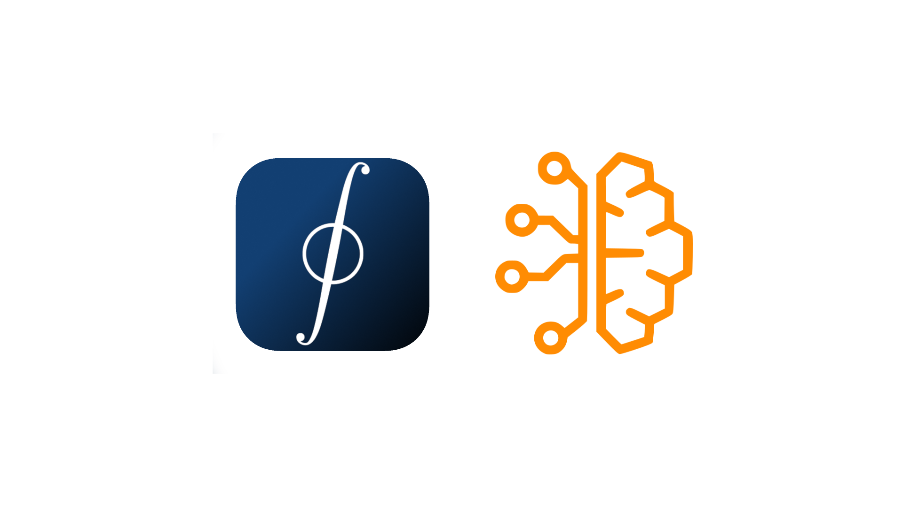

# Hi there! 👋 I'm Anas Lecaillon

Engineering Student at CentraleSupélec with a strong focus on Cybersecurity and AI.

## 🎓 About Me
- 🌟 Passionate about AI and Cybersecurity
- 🏛️ Based in Paris, France
- 🎯 Currently working on [GaussNotes](https://gaussnotes.com)
- 🔭 Exploring the intersection of mathematics and AI

## 🛠️ Projects & Contributions
- 🧮 [**mathlang**](https://github.com/anonx3247/mathlang): A simpler syntax for math typesetting written in Go
- 🤖 [**vai**](https://github.com/anonx3247/vai): A simple neural network library written in V
- 🔍 [**loop/loop-rs**](https://github.com/anonx3247/loop-rs): Implementation of Loop (a personal programming language) in Rust
- 🔧 [**vlm-webagents**](https://github.com/anonx3247/vlm-webagents): A dataset for finetuning small VLMs on web-agentic tasks
- 🎭 [**automathon**](https://github.com/Automatants/automathon-2024): 2024 DeepFake Hackathon with Automatants

## 🏆 Achievements & Involvement
- 🤖 Active member of [Automatants](https://github.com/Automatants) (Association d'Intelligence Artificielle de CentraleSupélec)
- ✍️ Creator of [GaussNotes](https://gaussnotes.com) - Math and Physics note-taking for the 21st century
- 🌟 GitHub Pro user
- 🔬 Participant in AI edge hackathon and Automathon 2024

## 📫 Get in Touch
- 🌐 Website: [anas.lecaillon.com](https://anas.lecaillon.com)
- 📧 Email: [anas@lecaillon.com](mailto:anas@lecaillon.com)
- 🔗 LinkedIn: [in/anas-lecaillon-8502a0290](https://linkedin.com/in/anas-lecaillon-8502a0290)

---

💡 Always learning, always building, always exploring the possibilities of AI and technology.

